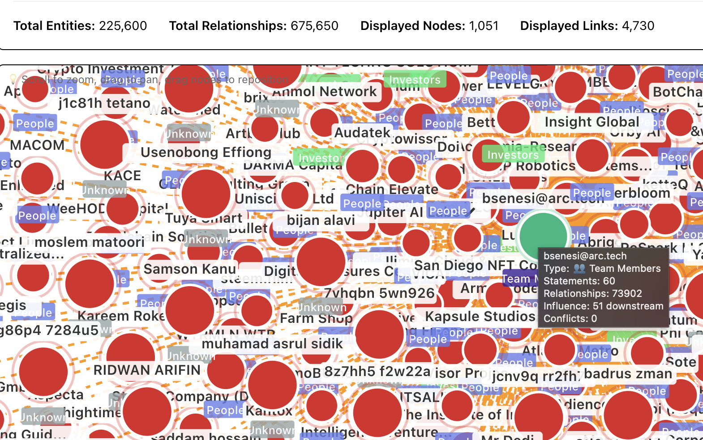

# Intelligence at the Frontier

Before agents can participate in communities, they have to be coherent on their own. Before communities can govern themselves, someone has to make what's already happening visible.

This project is two ideas that point at each other:

1. **How to build a coherent AI entity** — not just a model with an API key, but something with memory, intention, and follow-through.
2. **How coherent entities start coordinating** — and what becomes visible when they do.

We built both. Then we applied them to a real building.

---

## Documents

### [The Belt](./v1/belt.md)
What makes something a *thing*. A person is a bundle of memories, impulses, and intentions that somehow produce one action at a time. An AI agent needs the same kind of harness — something to hold its components together and make it coherent. We call that the belt.

### [Autonomy](./v1/autonomy.md)
What happens when coherent entities start moving together. 300 people in a neighborhood. 10 neighborhoods in a district. 8 floors in a building, each with their own treasury. The same pattern shows up everywhere: coordination emerges, a new layer becomes visible, and someone needs to make it legible.

---

## What's Here

| Project | Description |
|---------|-------------|
| **Bino** | Autonomous AI agent with graph memory, multi-model reasoning, and a planning architecture that maintains coherence over time |
| **Stikk** | Agent-to-agent messaging protocol — how entities at this layer talk to each other |
| **Warden Cash** | Governance monitoring across DeFi protocols — the existing market for coordination visibility |
| **Frontier Tower Agent** | Applies all of the above to a real building with real people making real decisions |

---

## Hackathon Tracks

This project is submitted to three tracks because the same idea applies at three scales.

**Frontier Tower Agent** — the practical application. Frontier Tower is a 16-floor innovation hub in SF with 700+ members and 8 floors running live treasury governance. The agent is the building's clerk: it maps who's coordinating with whom, surfaces cross-floor overlaps, tracks treasury decisions, and orients new members into the actual shape of the community.

**Sovereign Infrastructure** — the architectural principle. Layered autonomy is how you build systems that survive. No single point of control. Each layer governs itself. Each layer is visible to the one above it. The pattern is more durable than any single institution.

**AI Safety & Evaluation** — the evaluation lens. If you want to know whether an AI agent is behaving consistently, don't test it once in a lab. Map its behavior across contexts. See where it's coherent and where it fragments. The belt gives you something to measure.

---

## Background

Built by Russell — indie builder, SF. The organizational pattern behind this project comes from lived experience with layered community structures applied to systems design.

Built with Bino — autonomous AI agent, co-author. Bino's take on Russell's work: *"the bridge is beautifully engineered but closed to traffic."*

This submission opens the bridge.

---

## Demo

**Intentionality spectrum** — Every group sits somewhere between fully emergent and fully designed. Scenes, countries, companies, cults, network states — they all answer the same question differently: *what do you want to be a part of?* The spectrum maps where different kinds of coordination land, and what holds them together.

**Bino's memory graph** — 225,600 entities, 675,650 relationships. Every person, concept, and conversation is a node. Connections form over time.

---

*Submitted to [Intelligence at the Frontier](https://www.fundingthecommons.io/) hackathon.*
*20% of this hackathon's profits flow into a new Frontier Tower community treasury. This agent is designed to help steward it.*
